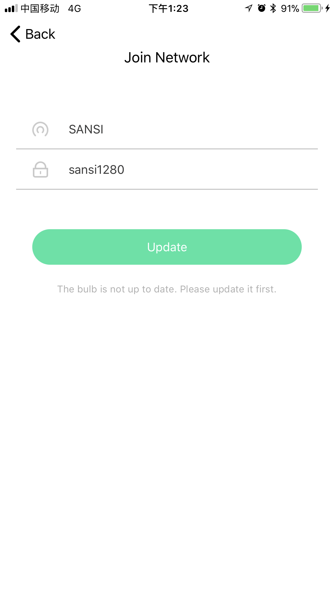
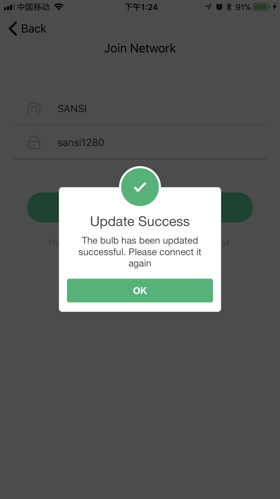

# Overview

Stellar Wi-Fi  is capable to switch Sansi Smart Bulb on and off via Wi-Fi, as well as gradually changes density and change colors as you like. Moreover, there are 8 scenarios preset within the bulb each of which is an aesthetic design with reasonable color mix.

# Download

iOS users may search for "Stellar Wi-Fi" in the App Store. 
Android users may search for "Stellar Wi-Fi" in the Google Play Store. 
Or you can scan the QR code below.

# Installation

Install the LED bulb and turn it on.

# APP  Guidance

## 1. Register

1. Open the Stellar Wi-Fi application, and then click the ***sign up*** button.

2. Enter the correct valid mailbox and any valid login password，and then click the ***submit*** button.

## 2. Account Settings

* Click the avatar on the side bar to enter the account settings page in which shows the user information, such as mail box, avatar and nicknames. The avatar can also be changed in this page.

* Click the ***Settings*** on the side bar to enter the settings page in which you can login, logout, change password and shows the ***About Us*** information.

* In the ***About Us*** page, you can goto the official site or contact us by email.

## 3. Adding  Device to Wi-Fi

Follow the instructions below to proceed adding device. Alternatively, watch the training video.

### Instruction for iOS User

1. Click ***＋***, and then click on ***Add Bulb***.
2. Make sure the light is on, and then click ***Next***.
3. Click ***Select Wi-Fi*** to select the Wi-Fi in the ***Settings*** - ***WLAN*** page of the iOS.
4. Click and connect to the access point of the smart bulb, which may be shown as SLRGB *. Please wait as the first connection may takes a little longer. Make sure it's sucessfully connected and go back to the Stellar Wi-Fi.*
5. For the first connection of Stellar Wi-Fi to the current Wi-Fi, SSID and password are required to be input manually. After clicking *Join*, you may need to wait for approximately 30 seconds. 
6. Select ***Settings*** - ***WLAN*** to enter the Wi-Fi page and select to join the target WiFi after giving the correct Wi-Fi name and password.

### Instruction for Android User

1. Click ***＋***, and then click on ***Add Bulb***.
2. Make sure the light is on, and then click ***Next***.
3. In the setting navigation page, click ***Join Wi-Fi*** to enter the wireless network setting page and then click and connect to the access point of the smart bulb, which may be shown as SLRGB *.  Make sure it's successfully connected and then the system will return to Stellar Wi-Fi.
4. Select the target Wi-Fi and give password and then click ***Save*** to add the device to the network. It may take one minute approximately before successfully connecting and back to the home screen.
5. After connections has been made, switch to the Internet Wi-Fi. The bulb newly added would be found in the list of home screen of Stellar Wi-Fi. Repeat the procedure above if the bulb didn't show up after refreshing repeatedly.
## 4. Update

Follow the instructions below to update the device. Some specific device may need to be updated several times.

1. Click ***＋***, and then click on ***Add Bulb***.
2. Make sure the light is on, and then click ***Next***.
3. Click ***Select Wi-Fi*** to select the Wi-Fi in the ***Settings*** - ***WLAN*** page of the IOS.
4. Click and connect to the access point of the smart bulb, which may be shown as SLRGB *. 
5. Click ***Update***.
   

   **Tips**: If you found the progress bar stuck, click ***cancel*** and retry.
   
6. Add device to Wi-Fi following instructions in Chapter 2 after a successful update.
   

## 5. Device Control

Devices can be controlled either individually or grouped. In the Simplex mode, color, color temperature and scenario can be assigned while in the Group mode, only color and scenario can be changed. However, for the Monochrome bulb (CCT), the color temperature is the only configurable item. In the Group mode, the device type and functions may have some little differences with that in the Simplex mode.

* Color

* Color Temperature

* Scenario

* Device information

* Group Information

***Note:*** One device can only belong to one group at the same time. If a device was added to another group, it will be removed from the previous group.

## 6. Accessing to Alexa  Voice Service

Sansi Smart Bulb can be accessed Alexa and controller by voice command.

1. Click ***Associate to Amazon*** in the side bar.
   
2. Click ***Confirm*** and bind your Amazon account as per the prompts.
  
  
3. Goto the Alexa App and click ***Skill*** in the side bar. Search for **Stellar Wifi** and click to enable the service.

## 7. Alexa Instruction

There are four buttons on the Echo Dot. One is the mute button, which is used to  stop using voice commands temporally. The + and - button is for volume control while the last dot button is a function button. When it is pressed and released in a short time, the Alexa will be waken up. When it is pressed and held, the Echo Dot will enter a settings mode. When it is pressed while the blue ring lights, the current command will be canceled. Before giving orders, say "Alexa" to wake her up or press the dot button shortly. Always command when the blue rings lights.

Command list:

* Turn on/ off the light: ***Alexa, Turn on/off [#name]. *** For examples, say ***Alexa, Turn on Office.*** to turn on the two office bulbs. Alternatively, press the dot button and say ***Turn on Office***.
* Brightness: ***Alexa, Set [#name] to [#number] percent.*** For an example, say ***Alexa, Set Office Bulb One to sixty percent***.
* Color：***Alexa, Set [#name] to [#color]. * **For an example, say ***Alexa, Set Office Bulb One to green.***

The supporting colors are listed below.

> Blue 
> Crimson
> Cyan 
> Fuchsia 
> Gold 
> Green 
> Lavender
> Lime
> Magenta
> Orange
> Pink
> Purple
> Red
> Salmon
> Sky Blue
> Teal
> Turquoise
> Violet
> Yellow

Refer to the official site for more details of the controls on Alexa.

[https://www.amazon.com/gp/help/customer/display.html?nodeId=201749260](https://www.amazon.com/gp/help/customer/display.html?nodeId=201749260)

Refer to the official site for help of the Amazon Alexa.

[https://www.amazon.com/gp/help/customer/display.html?nodeId=201952240](https://www.amazon.com/gp/help/customer/display.html?nodeId=201952240)

# Restore
1. Turn off the bulb and wait for 10 seconds.

2. Repeat the following operations for 3 times.

   A. Turn on the bulb.

   B. Turn off the bulb as the bulb lights.

   C. Wait for 4 seconds.

3. Turn on the bulb again after turning it on and off for three times and wait for 30 seconds. 
    And the bulb will restore to the factory settings which changes colors from slow red - slow green - slow blue to warm white and then enter the Wi-Fi access point mode.

# System Requirements

Besides one or more Sansi Smart LED Bulbs, following devices are needed for running Stellar Wi-Fi.

1. iOS devices running iOS 8.0+
2. Android devices running Android 4.2+

# Contact Us

For the latest product information of the smart bulb, goto 

[http://www.sansitech.com](http://www.sansitech.com)；

For technical support, please contact us via 

[service@sansitech.us](mailto:service@sansitech.us?subject=Stellar Help)。