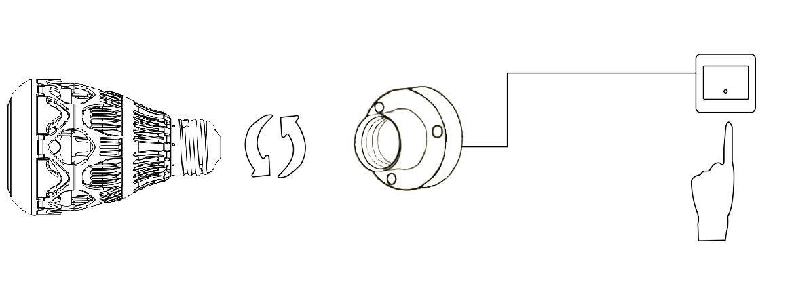
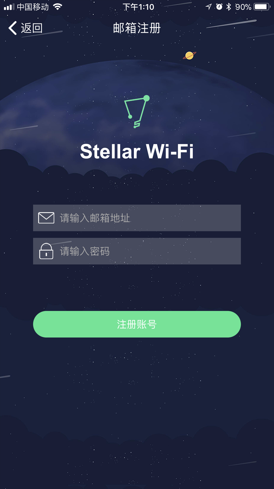
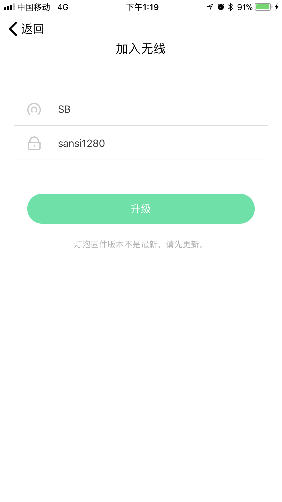
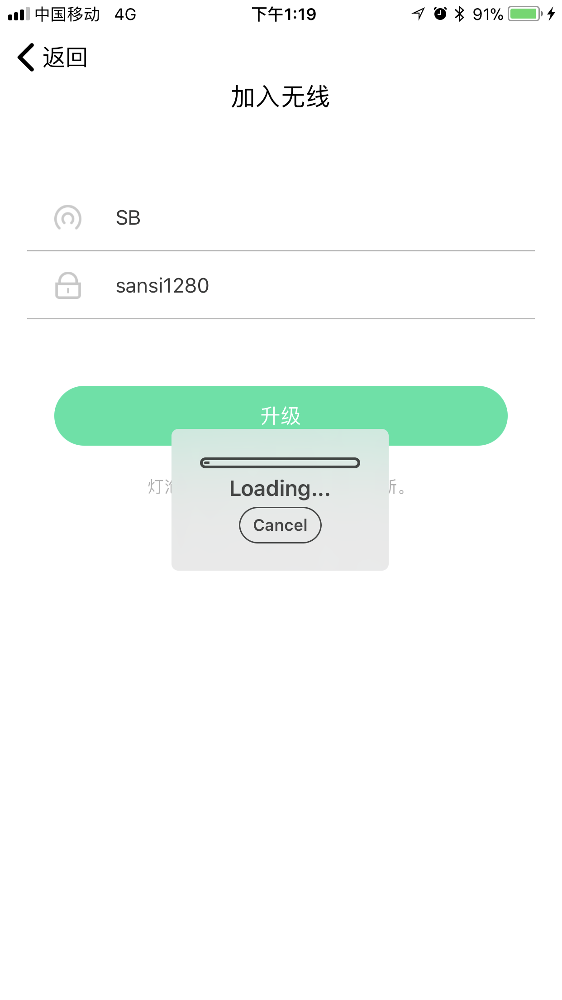
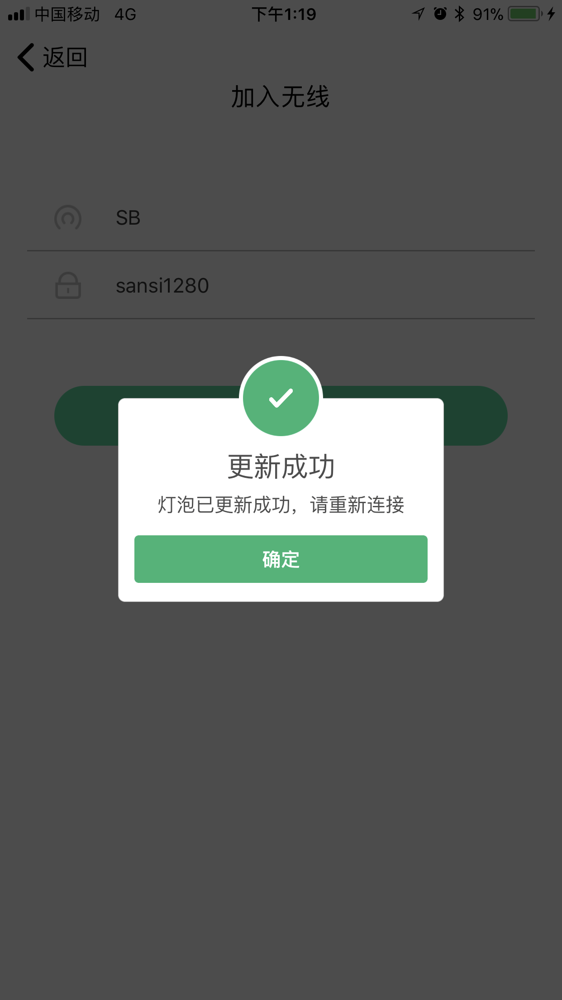
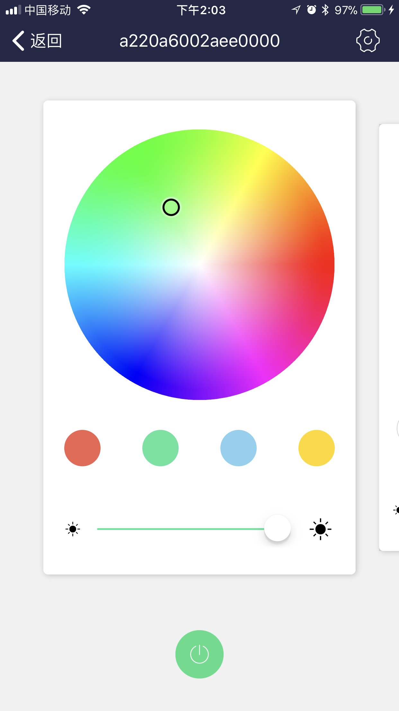
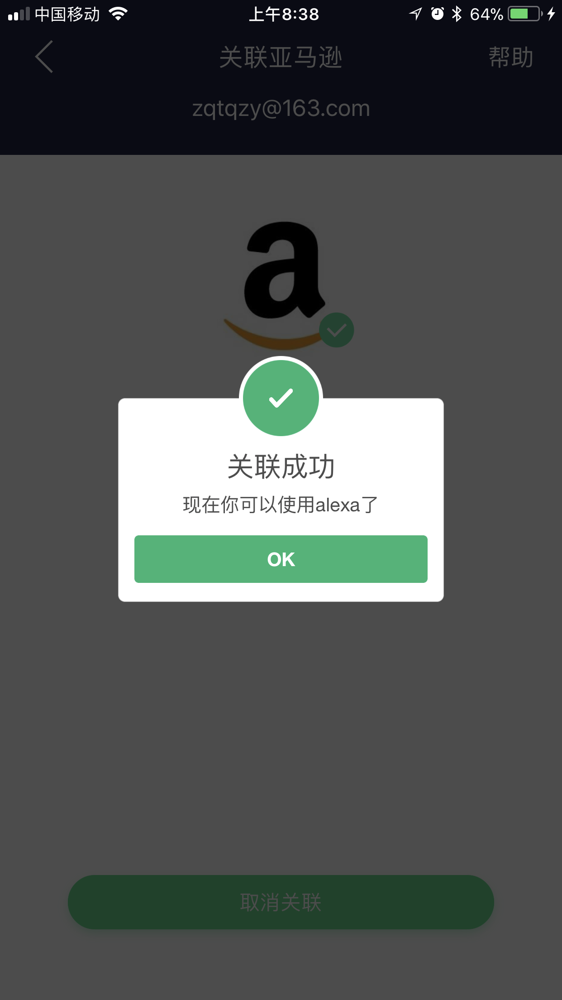

# 简介

Stellar Wi-Fi 应用无线控制三思智能球泡灯，开、关无级调节亮度，可选择自己喜欢的颜色。灯泡内置了8种预设场景。

# 获取应用

iOS 用户在“App Store”中搜索并安装“Stellar Wi-Fi”。
安卓用户在Google Play、豌豆荚中搜索并安装“Stellar Wi-Fi”。
或扫描下方二维码，下载应用。

# 安装设备

将灯泡拧入灯座，打开电源开关。

# APP操作简介

## 1. 注册账号

* 打开Stellar Wi-Fi 应用，点击注册账号。

* 输入邮箱和登录密码，点击注册，注册成功后将自动登录到APP主页。

## 2. 账号管理

* 点击侧边栏中的头像图标进入用户信息界面，查看邮箱、修改头像和昵称。

* 点击侧边栏中的***设置***进入设置界面，退出登录、修改密码或者进入关于我们界面。

* 在关于我们界面，你可以访问我们公司的官网，或者发邮件联系我们。

## 3. 将设备添加到目标WiFi及个人账户

请按照以下步骤操作，如有疑问可以观看视频。

### ios操作流程

1. 点击右上角***＋***按钮，点击***添加灯***。
2. 确认灯是点亮状态，点击下一步。
3. 点击选择无线网。会跳到手机设置->无线网设置界面。
4. 点击连接球泡灯Wi-Fi网络,并确认连接成功（全彩球泡灯网络名称类似 SLRGB*********首次连接可能等待时间稍长）。
5. 首次加入目标WiFi需要手动输入WiFi名称和密码（**请确保你的WiFi能连接到外网**），点击加入。此过程需要大约30s。
6. WiFi密码和账号输入无误后，点击选择无线网路会跳到手机设置->无线网设置界面，选择目标WiFi，点击连接后返回Stellar Wi-Fi。

### Andriod操作流程

1. 点击右上角***＋***按钮，点击***添加灯***。
* 确认灯是点亮的状态，然后点下一步。
* 进入设置导航界面，然后点连接WiFi按钮，进入手机无线网络设置界面,选择点击连接球泡灯WiFi网络（全彩灯泡的网络名称“SLRG B******”）并确保连接成功
* 选择目标网络，设置密码，最后点击保存，将灯加入目标网络，此操作可能需要1分钟左右，加入成功后返回主界面
* 当提示连接成功后，切换wifi，返回Stellar WiFi主界面，就能找到在列表中找到灯啦。(如果多次刷新列表都没有找到灯，请重新尝试上述步骤)

注：如果加入WiFi操作成功但主界面列表中并没有找到该设备，请

## 4. 设备升级

如果设备版本不是最新，则需要升级才能执行上述操作，升级步骤如下（个别设备可能需要多次升级）。

1. 点击右上角***＋***按钮，点击***添加灯***。
2. 确认灯是点亮状态，点击下一步。
3. 点击选择无线网。会跳到手机设置->无线网设置界面。
4. 点击连接球泡灯WiFi网络,并确认连接成功（全彩球泡灯网络名称类似 SLRGB*********首次连接可能等待时间稍长）。
5. 点击***升级***。

6. 如果进度条卡主不动了，请点击***cancel***重新尝试。

7. 更新成功后，请重新执行步骤2的操作。

## 5. 设备控制

设备控制分为**单控**和**组控**两个部分。单控模式下，提供颜色、色温以及场景种控制界面（对于***软件版本<5的彩色（RGB）***球泡灯，仅提供颜色、场景两种控制界面，对于***单色（CCT）***,仅提供色温一种控制界面）。组控模式下，根据组内所包含的设备类型，功能略有取舍。

* 颜色控制界面

* 色温控制界面

* 场景控制界面

* 设备信息界面

* 分组信息界面

关于分组需要注意的是，***一个设备同时只能别添加到一个组中，如果你想将它添加到另一个分组中，它将会被从原有分组中移除***。

## 6. 接入Alexa语音控制平台

三思智能球泡灯可以接入Alexa语音平台，使用语音对球泡灯进行控制。（关于如何配置Echo，前查看亚马逊Alexa的相关帮助）

1. 点击侧边栏***关联亚马逊***。

* 点击***确认关联***，根据提示绑定你的亚马逊账号。

* 前往Alexa App，在侧边栏点击***Skill***，通过搜索找到**Stellar Wifi**，设置其为**Enable**

## 7. Alexa使用说明

Echo Dot上有四个按钮，一个是静音禁唤醒按钮（意味着暂停使用），两个是音量输出增减按钮，剩下的一个按钮（小点）有三个功能，短按是唤醒功能，长按是进入设置状态，在蓝圈亮起时短按则是取消当前指令。对Echo Dot使用语音指令时，先说“Alexa”唤醒该设备（或者短按设备上的小点按钮），当设备亮起蓝圈后，再说具体的语音指令。

具体指令：

* 开/关灯：Alexa, Turn on/off [#name]. （例：Alexa, Turn on Office. 两个灯都会亮。或者按下设备上的小点按钮，然后说Turn on Office亦可）
* 设置亮度：Alexa, Set [#name] to [#number] percent. （例：Alexa, Set Office Bulb One to sixty percent.）
* 设置颜色：Alexa, Set [#name] to [#color]. （例：Alexa, Set Office Bulb One to green.）

官网显示支持的颜色包括:

> Blue (蓝色)
> Crimson (深红色)
> Cyan (青色)
> Fuchsia (紫红色)
> Gold (金色)
> Green (绿色）
> Lavender（薰衣草色）
> Lime（石灰色）
> Magenta（品红色）
> Orange（橙色）
> Pink（粉红色）
> Purple（紫色）
> Red（红色）
> Salmon（鲑红色）
> Sky Blue（天蓝色）
> Teal（水鸭蓝）
> Turquoise（青绿色）
> Violet（紫罗兰色）
> Yellow（黄色）

更多有关控制可参考官方文档:

[https://www.amazon.com/gp/help/customer/display.html?nodeId=201749260](https://www.amazon.com/gp/help/customer/display.html?nodeId=201749260)

关于亚马逊的智能家居Alexa的更多使用帮助，可访问官方文档:

[https://www.amazon.com/gp/help/customer/display.html?nodeId=201952240](https://www.amazon.com/gp/help/customer/display.html?nodeId=201952240)

# 灯泡恢复出厂设置步骤
1. 关闭灯泡电源，等待10秒。
- 将下列操作重复3次：
	1. 打开灯泡电源。
 	2. 当灯泡亮起后，即刻关闭电源。
 	3. 等待4秒。
3. 第4次打开灯泡电源，等待30秒。

灯泡恢复出厂设置后，将依照下述顺序变化“红光渐变、绿光渐变、蓝光渐变最后停止为白光”(RGBW球泡灯)并进入Wi-Fi接入点模式。

# 运行环境需求
Stellar Wi-Fi应用可以在如下平台运行：

运行 iOS 8.0 及以上版本的 iOS 设备。
安卓4.2及以上机型。
您还需要一个或多个三思智能球泡灯。

# 联系我们
获取智能球泡灯产品的最新消息，请访问: 

[http://www.sansitech.com](http://www.sansitech.com)；

需要技术支持，请联系: 

[service@sansitech.us](mailto:service@sansitech.us?subject=Stellar Help)。